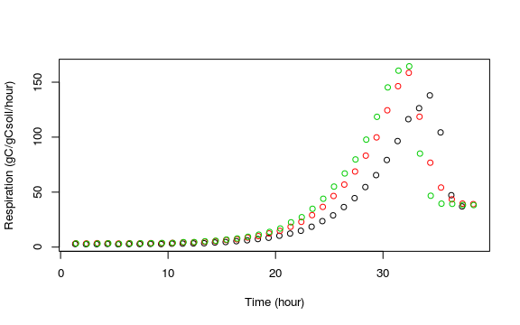
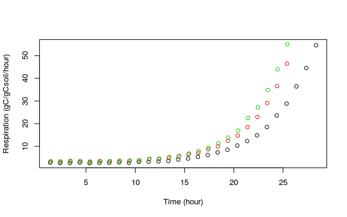
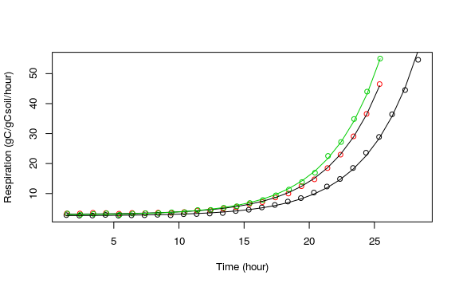
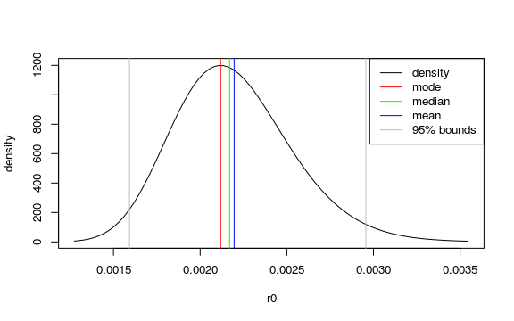

Experimental data
-----------------

Here we take respiration time series from the dataset in Wutzler 2012 of
one experiment consisting of incubation of three replicate soil samples.

    library(twKinresp, quietly = TRUE) 
    rde <- subset(respWutzler10, suite == "Face" & experiment == 9 )
    summary(rde)

    ##        suite       experiment  replicate      time       
    ##  Face     :113   9      :113   1:37      Min.   : 1.358  
    ##  Fal      :  0   1      :  0   2:38      1st Qu.:10.400  
    ##  Pushchino:  0   2      :  0   3:38      Median :19.441  
    ##                  3      :  0             Mean   :19.736  
    ##                  4      :  0             3rd Qu.:29.358  
    ##                  5      :  0             Max.   :38.441  
    ##                  (Other):  0                             
    ##       resp        
    ##  Min.   :  2.627  
    ##  1st Qu.:  3.594  
    ##  Median : 12.352  
    ##  Mean   : 34.773  
    ##  3rd Qu.: 46.717  
    ##  Max.   :164.403  
    ## 

    plot( resp ~ time, data = rde, col = rde$replicate
          , xlab = "Time (hour)", ylab = "Respiration (gC/gCsoil/hour)")

First, we constrain each time series to the unlimited exponential growth
phase. The package achieves this byfitting a three parameter exponential
equation to successively shortened time series. A deviation from the
exponential model introduces positive correlations in the model-data
residuals. Hence, the longest time series is selected where there was no
positive correlation in the model-data residuals between the mimimum and
the last last point.

This works quite well with data that displays a typical exponential
growth phase but fails if there are deviations from exponential growth
present, such as small oscillations in the respiration. Then the records
have to be selected manually.

    res4 <- kinrespGrowthphaseExperiment(rde, weights = varPower(fixed = 0.5) )
    rde.e <- getUnlimitedGrowthData(res4)
    plot( resp ~ time, data = rde.e, col = rde.e$replicate
          , xlab = "Time (hour)", ylab = "Respiration (gC/gCsoil/hour)")

Mixed linear models
-------------------

We are interested of the microbial growth parameters for the soil, i.e.
across the replicates.

There are several suboptimal approaches to aggregate across replicates.

-   Fitting a single growth curve to all the data points
-   Computing the mean respiration for each time and fitting a model to
    the single aggregated series
-   Fitting a growth curve to each replicate, and then taking the
    average across the parameters

The last approach is wrong because the growth curve of the averaged
parameters is not an average growth curve.

The two first approaches will provide a good average growth curve but
provide wrong uncertainty bounds. The first approach neglects the
groupings, i.e. dependency between the observations of one replicate and
underestimates uncertainty. The second approach drops the advantage of
having multiple replicates and can overestimate uncertainty.

Nonlinear mixed effects models provide an proper statistical approach
that uses all of the records and accounts for the groupings ob
observations of a replicate. This approach is implemented in this
package.

Fitting and inspecting the mixed effects kinetic respiration model
------------------------------------------------------------------

Several versions with random effects in different parameters are fitted,
and the model with lowest AIC is selected.

    res5Scen <- fitKinrespExperiment(
      #,showFitErrorMsg = TRUE
      rde.e, coefKinresp(res4,rde.e), weights = varPower(fixed = 0.5))
    res5Scen$aics

    ##           none            x0l            r0l        x0l+r0l x0l+r0l+mumaxl 
    ##      346.26857      195.18590      109.47063       87.51931             NA

In the example, the variant with the lowest AIC had a random effect in
initial biomass, *x*0, and initial proportion of active
biomass, *r*0, indicating that those properties differed
across replicates.

The variant with a random effect in additionally the maximum growth
rate, *μ**m**a**x*, could not be fitted to the data
(AIC==NA). This indicates either no differences between the replicates
or not enough replicates to resolve their differences.

A plot of the fits to the individual replicates shows a good agreement
between the model and the observations.

The selected model object is stored in entry `model` of the result.

    kFit = res5Scen$model
    fixef(kFit)

    ##    mumaxl       r0l       x0l 
    ## -1.371856 -6.130984  5.016201

Transformed and original scale
------------------------------

The model parameters *x*0 and *μ**m**a**x* are
constrained to be strictly positive and their confidence interval should
not include values below zero. Therefore, log-transformed versions,
*x*0*l* and *μ**m**a**x**l* are fitted with the
model. This corresponds to assuming that they are log-normally
distributed. The values and distribution quantiles at original scale are
simply found by taking the exponential of their values.

Similarly, model parameter *r*0 is constrained in interval
(0, 1). Hence, the model fits a logit-transformed version
*r*0*l*, and the values at original scale are found by
applying the `invlogit` function.

To simplify the process, function `coefKinresp` and `confintKinresp`
apply these conversions.

    #exp(fixef(kFit)["x0l"])
    #invlogit(fixef(kFit)["r0l"])
    coefKinresp(fixef(kFit))

    ##        mumax           r0           x0 
    ## 2.536358e-01 2.169723e-03 1.508371e+02

The uncertainty bounds of the population grwoth parameters at original
scale are:

    confintKinresp(confint(kFit))

    ##               2.5%        97.5%
    ## mumax 2.495446e-01 2.577940e-01
    ## r0    1.592317e-03 2.955886e-03
    ## x0    1.391831e+02 1.634669e+02

The help page `?coefKinresp` links to further functions accessing the
fitted results at transformed and original scale.

Note, that the expected value of a lognormal distribution depends on
both, the location, *μ*, and the shape parameter, *σ*, and is larger
than the exponential of *μ*:

*E*(*x*)=*e**μ* + *σ*2/2

Function `kinrespParDist` computes this expectec value and other
statistics. We recommend reporting the distribution parameters
(*μ*, *σ*) along with the expected value and the confidence bounds.

    pars <- kinrespParDist(kFit)
    pars[,c("mean","cf025","cf975","mu","sigma")]

    ##               mean        cf025        cf975        mu       sigma
    ## x0    1.509598e+02 1.391831e+02 1.634669e+02  5.016201 0.040327171
    ## r0    2.195926e-03 1.592317e-03 2.955886e-03 -6.130984 0.155464482
    ## mumax 2.536442e-01 2.495446e-01 2.577940e-01 -1.371856 0.008155407

The skewness is vizalized by the following plot of the density
distribution of initially active fraction *r*0.

